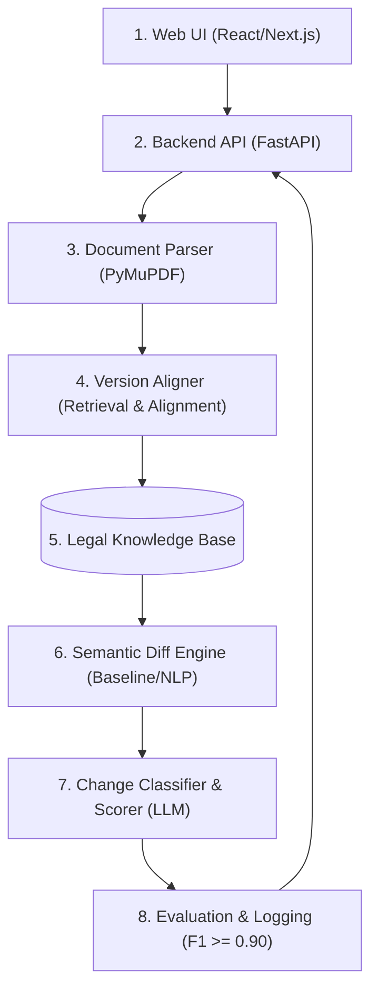

**Group 4 – Legal Document Change Detection**

* **Đề tài:** Project 7 – Legal Document Change Detection (Engineering / R&D – ★★★)
* **Bài toán:** Phát hiện các thay đổi **CÓ Ý NGHĨA** pháp lý (Semantic Diff) giữa hai phiên bản văn bản pháp luật/hợp đồng, phân biệt rạch ròi với những thay đổi về văn phong/chính tả thông thường.

🔗 **Tài liệu dự án (Yêu cầu đọc theo thứ tự):**
1. [Business Requirements Document (BRD)](docs/brd.md)
2. [System Requirements Specification (SRS)](docs/srs.md)

---

## 1. Sơ đồ Kiến trúc Tối thiểu (Minimum Architecture)



## 2. Mục tiêu Hệ thống & Chỉ số Nghiệm thu (Targets)
- Change Detection F1: >= 0.90 (Phát hiện chính xác điều khoản bị đổi nghĩa).
- Critical Change Recall: >= 95% (Không bỏ sót các thay đổi trọng yếu về quyền, nghĩa vụ, thời hạn, chế tài tài chính).

## 3. Cấu trúc Thư mục Dự án
```
group4_legal_document_change_detection/
├── docs/                       # Tài liệu đặc tả BRD và SRS
├── data/                       # Chứa data/raw, data/dev_set, data/test_set
├── src/
│   ├── schemas.py              # Định nghĩa JSON Schema (Data Contract)
│   ├── parser/                 # Tách Điều/Khoản (FR-01)
│   ├── aligner/                # Module Version Aligner (FR-02)
│   ├── semantic_diff/          # Module Semantic Diff Engine (FR-03)
│   ├── classifier_scorer/      # Module Change Classifier & Scorer (FR-04)
│   ├── evaluation/             # Script tính toán F1, Recall (FR-05)
│   └── pipeline.py             # Luồng tích hợp End-to-End nối 4 module
├── backend/                    # API Server (Python FastAPI)
├── frontend/                   # Giao diện Web UI
└── requirements.txt            # Danh sách thư viện cần cài đặt
```

## 4. Hướng dẫn Cài đặt & Chạy thử (Quick Start)
- Bước 1: Cài đặt thư viện môi trường
```
pip install -r requirements.txt
```

- Bước 2: Chạy kiểm thử luồng Pipeline xử lý văn bản
```
python -m src.pipeline
```

- Bước 3: Khởi chạy Backend API Server
```
uvicorn backend.main:app --reload
```
- Truy cập API Docs tại: http://127.0.0.1:8000/docs
