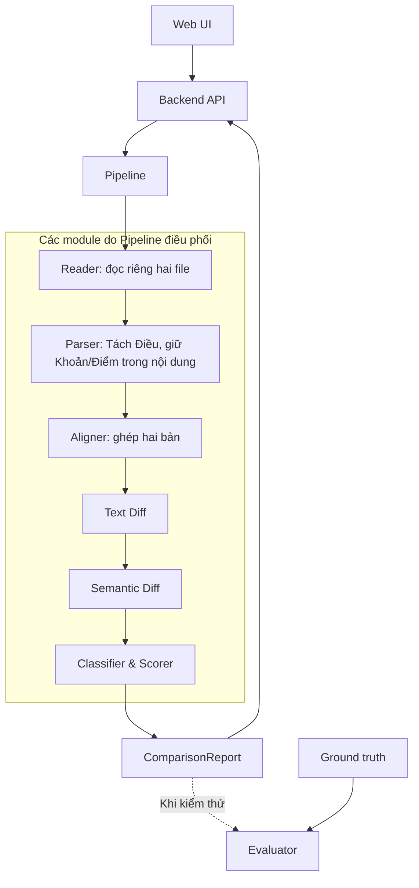

<h1 align="center">Group 4 – Legal Document Change Detection</h1>

* **Đề tài:** Project 7 – Legal Document Change Detection (Engineering / R&D )
* **Bài toán:** Phát hiện các thay đổi **CÓ Ý NGHĨA** pháp lý (Semantic Diff) giữa hai phiên bản văn bản quy phạm pháp luật Việt Nam, phân biệt rạch ròi với những thay đổi về văn phong/chính tả thông thường.

**Tài liệu dự án (Yêu cầu đọc theo thứ tự):**
1. [BRD](brd.md): mục tiêu và phạm vi.
2. [SRS](srs.md): yêu cầu và hợp đồng dữ liệu.
3. [Architecture](architecture.md): thiết kế module và luồng xử lý.
4. [Implementation Plan](implementation-plan.md): công nghệ,
   phân công và tiến độ triển khai.
5. Mã nguồn: baseline hiện tại.

---

## 1. Minimum Architecture dự kiến

Thiết kế mục tiêu của bản đầu sử dụng request đồng bộ: backend xử lý hai file và
trả ComparisonReport trong cùng request; không dùng job nền
hoặc API polling.

Các module xử lý nằm trong một backend Python.
Pipeline điều phối Reader, Parser, Aligner, Text Diff,
Semantic Diff và Classifier & Scorer.



Evaluator chạy riêng khi kiểm thử. Logging ghi nhận xuyên suốt
các bước xử lý. Legal Knowledge Base chưa thuộc kiến trúc tối thiểu.
Chưa chốt việc dùng LLM/API ngoài hoặc công nghệ frontend.

## 2. Mục tiêu Hệ thống & Chỉ số Nghiệm thu (Targets)
- Change F1 ≥ 0,90: đo khả năng phát hiện từng thay đổi nghĩa.
- Critical Change Recall ≥ 0,95: tìm đúng ít nhất 95% thay đổi
  được gán nhãn CRITICAL theo bộ tiêu chí thống nhất.
- Đo trên bộ kiểm thử độc lập; đây là mục tiêu, chưa phải kết quả đạt được.

## 3. Cấu trúc Thư mục Dự án
```
group4_legal_document_change_detection/
├── docs/                       # Tài liệu đặc tả BRD và SRS
├── data/                       # cấu trúc dự kiến: data/raw, data/dev_set, data/test_set
├── src/
│   ├── schemas.py              # Cấu trúc dữ liệu hiện tại; cần cập nhật theo SRS
│   ├── parser/                 # Tách cấp Điều
│   ├── aligner/                # Module Version Aligner 
│   ├── semantic_diff/          # Module Semantic Diff Engine 
│   ├── classifier_scorer/      # Module Change Classifier & Scorer
│   ├── evaluation/             # Script tính toán F1, Recall
│   └── pipeline.py             # Pipeline baseline hiện tại; cần cập nhật theo SRS
├── backend/                    # API Server (Python FastAPI)
├── frontend/                   # Giao diện Web UI
└── requirements.txt            # Danh sách thư viện cần cài đặt
```

## Hiện trạng triển khai

> **Lưu ý:** SRS và Minimum Architecture mô tả thiết kế mục tiêu hoàn chỉnh của hệ thống. Mã nguồn hiện tại trong repository mới dừng lại ở mức **baseline** để kiểm thử luồng cơ bản:

- **API & Input:** API hiện chỉ nhận 2 chuỗi text thô (`raw strings`), chưa hỗ trợ upload file tài liệu trực tiếp.
- **Thành phần còn thiếu:** Chưa tách riêng module `Reader`, `Text Diff` chuyên biệt và chưa xây dựng giao diện người dùng (UI/Frontend).
- **Data Schemas:** `schemas.py` chưa đồng bộ đầy đủ theo hợp đồng dữ liệu (data contract) mới nhất.
- **Logic xử lý:** Các module `Semantic Diff` và `Scorer` mới áp dụng các rule-based đơn giản, chưa tích hợp NLP chuyên sâu.
- **Đánh giá (Evaluator):** Module `Evaluator` cần tiếp tục cập nhật để đo lường đầy đủ các loại lỗi và hỗ trợ đánh giá chi tiết trên từng thay đổi (fine-grained diff evaluation).
- **Bộ dữ liệu nghiệm thu:** Chưa hoàn thiện bộ benchmark/dataset chuẩn để chứng minh hệ thống đạt các mục tiêu nghiệm thu đề ra.

*Dự kiến bổ sung `python-docx` khi phát triển phân hệ trích xuất văn bản Word (`.docx`). Hiện tại dự án chưa tích hợp API AI thương mại bên ngoài.*

---

## 4. Hướng dẫn Cài đặt & Chạy thử (Quick Start)
- Bước 1: Cài đặt thư viện môi trường
```
pip install -r requirements.txt
```

- Bước 2: Chạy kiểm thử luồng Pipeline xử lý văn bản
```
python -m src.pipeline
```

- Bước 3: Khởi chạy Backend API Server
```
uvicorn backend.main:app --reload
```
- Truy cập API Docs tại: http://127.0.0.1:8000/docs


