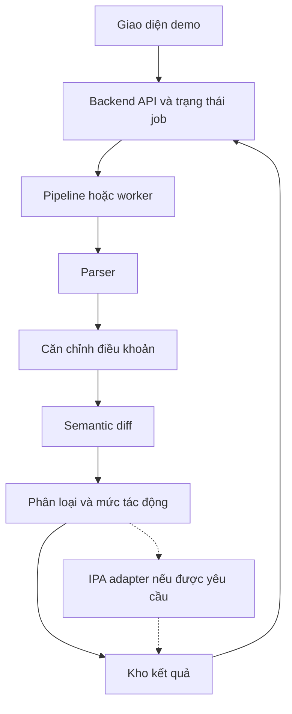

#  SOFTWARE ARCHITECTURE & BUSINESS REQUIREMENTS SPECIFICATION
**Project:** Project 7 — Legal Document Change Detection
**Architecture Level:** Level 5 — AI Application (RAG & Reasoning)
**Document Version:** 1.0.0
**Author:** Bạch Công Dũng (Architecture & Documentation Owner)

---

## 1. VẤN ĐỀ VÀ MỤC TIÊU DỰ ÁN (PROBLEM & OBJECTIVES)

### 1.1. Thực trạng & Vấn đề (Problem Statement)
Khi một văn bản pháp lý hoặc hợp đồng có phiên bản mới, người đọc phải tự đối chiếu và so sánh từng điều khoản bằng tay. Quá trình này tốn nhiều thời gian và rất dễ bỏ sót các thay đổi quan trọng (ví dụ: thay đổi thời hạn thanh toán từ 30 ngày thành 15 ngày, hoặc tăng mức phạt vi phạm, thay đổi ngữ nghĩa các cụm từ(tối thiểu,tối đa,....) ).

### 1.2. Mục tiêu hệ thống (Project Objectives)
* Tự động phát hiện các điều khoản bị thay đổi giữa hai phiên bản văn bản.
* Phân biệt chính xác giữa **thay đổi văn phong/diễn đạt** và **thay đổi ngữ nghĩa pháp lý thực sự**.
* Tự động đánh giá mức độ quan trọng và gán nhãn rủi ro cho các biến đổi pháp lý.

### 1.3. Đối tượng sử dụng (Target Users)
* Các nhóm pháp lý, quản trị rủi ro và tuân thủ (Compliance) trong doanh nghiệp.
* Chuyên viên pháp chế, luật sư và các đơn vị cung cấp dịch vụ pháp lý chuyên nghiệp.
* Khối cơ quan nhà nước, nhà làm luật, các nhóm nghiên cứu và sinh viên ngành Luật.
* cá nhân có liên quan tùy theo loại luật: giao thông, nhà đất, hôn nhân...... 

---

## 2. PHẠM VI BÀI TOÁN & GIỚI HẠN (SYSTEM BOUNDARY)

### 2.1. Trong phạm vi (In-Scope)
* **Loại văn bản:** Các văn bản Quy phạm pháp luật (VBQPPL) Việt Nam (Luật, Nghị định, Thông tư, Quyết định).
* **Đặc điểm:** Văn bản tiếng Việt, có cấu trúc phân cấp chuẩn theo "Điều", "Khoản", "Điểm".
* **Tác vụ:** So sánh 2 phiên bản của cùng 1 văn bản (Văn bản gốc $V_1$ vs Văn bản sửa đổi, bổ sung, thay thế $V_2$). Nhận diện sự biến đổi về nghĩa vụ, thời hạn, mức phạt và phạm vi trách nhiệm.

### 2.2. Ngoài phạm vi (Out-of-Scope)
* Xử lý OCR đối với DOCX và PDF có lớp text nếu đó là phạm vi nhóm chốt; không hỗ trợ PDF scan trong MVP.
* Phân biệt không nhận văn bản độc lập không có bản trước với vẫn phát hiện thêm/xóa điều khoản trong cặp V1/V2.
* Tự động gom nhóm các văn bản sửa đổi nằm rải rác từ nhiều nguồn khác nhau.
* Tư vấn pháp lý tự động hoặc xử lý các văn bản phi cấu trúc, văn bản bằng ngôn ngữ khác ngoài tiếng Việt.

---

## 3. SƠ ĐỒ KIẾN TRÚC TỔNG THỂ (SYSTEM ARCHITECTURE)

### 3.1. Sơ đồ (Diagram)


### 3.2 Ranh giới module và cấu trúc thư mục

```text
backend/main.py                    # Đức Anh
src/schemas.py                     # Đức Anh hiện thực, Dũng đặc tả
src/pipeline.py                    # Đức Anh
src/parser/doc_parser.py           # Thọ
src/aligner/version_aligner.py      # Thọ
src/semantic_diff/diff_engine.py    # Ngọc Anh
src/classifier_scorer/scorer.py     # Ngọc Anh
src/integrations/ipa_adapter.py     # Đức Anh
src/evaluation/evaluator.py         # Tuấn Anh
frontend/                          # Tuấn Anh, demo tối thiểu
tests/fixtures/                    # Fixture chung theo schema v1
data/raw/                          # Dũng
data/02_filtered_pairs/            # Dũng
data/03_parsed_clauses/             # Parser và aligner
data/04_semantic_diffs/             # Diff và scorer
data/manifest.csv                  # Dũng
data/gold/                         # Tuấn Anh điều phối nhãn chuẩn
docs/                              # Tài liệu tổng quát và tài liệu module
```
### 3.3 Tương tác giữa các module đề xuất

- `parse_document(file_ref, metadata) -> ParsedDocument`
- `align_versions(old_document, new_document) -> AlignedPair`
- `detect_changes(aligned_pair) -> ChangeCandidates`
- `classify_and_score(candidates) -> ChangeReport`
- `evaluate(predictions, gold_labels) -> EvaluationReport`
- `evaluate_ipa(report) -> IpaReport` chỉ dùng khi xác nhận đặc tả.


### 3.4 Enum thống nhất

- `alignment_status`: matched, added, removed, ambiguous.
- `change_kind`: unchanged, editorial, substantive, uncertain.
- `change_types`: deadline, obligation, sanction, scope, condition_exception, amount, other; là danh sách có thể nhiều nhãn.
- `significance`: LOW, MEDIUM, HIGH, CRITICAL; null cho unchanged hoặc khi chưa đủ cơ sở đánh giá. Không dùng song song MAJOR/MINOR.
- `job.status`: queued, running, succeeded, failed. Với runner tối thiểu vẫn giữ cùng API contract.

### 3.5 Mẫu bàn giao tối thử để kiểm tra tích hợp

 *lưu ý:Mẫu sau là ví dụ tự tạo dùng kiểm tra tích hợp, không phải dữ liệu pháp luật thật.

```json
{
  "schema_version": "1.0",
  "pair_id": "demo_001",
  "alignments": [{
    "alignment_id": "demo_001_a1",
    "alignment_status": "matched",
    "alignment_confidence": 1.0,
    "old_clause": {"clause_id": "v1_c1", "path": "Điều 1/Khoản 1", "text": "Thời hạn thanh toán là 30 ngày.", "source_ref": {"file": "demo_v1.txt", "paragraph_index": 1}},
    "new_clause": {"clause_id": "v2_c1", "path": "Điều 1/Khoản 1", "text": "Thời hạn thanh toán là 15 ngày.", "source_ref": {"file": "demo_v2.txt", "paragraph_index": 1}}
  }]
}
```
---
## 5. WORKFLOW & PHÂN CÔNG NHÂN SỰ (5 MEMBERS)

### 5.1) WORKFLOW
Người dùng tải V1 và V2 → API kiểm tra đầu vào và tạo job → parser trích xuất và tách điều khoản → aligner ghép điều khoản tương ứng → semantic diff phát hiện thay đổi → classifier và scorer gán nhãn → lưu báo cáo → API trả trạng thái và kết quả cho giao diện. UI luôn truy cập dữ liệu qua API.

Data collection diễn ra trước và song song với phát triển, phục vụ dữ liệu demo và đánh giá; đây không phải bước bắt buộc mỗi lần người dùng tải file. Bộ đánh giá chạy riêng trên dữ liệu có nhãn. IPA AI được đặt sau báo cáo qua adapter riêng, chờ xác nhận đặc tả và yêu cầu môn học.

### 5.2) PHÂN CÔNG CÔNG VIỆC SONG SONG, CÁC MODULE
đầu tiên chốt schema v1 và bộ JSON mẫu. Sau đó mỗi người dùng fixture hoặc mock thay cho module chưa hoàn thành. Ghép bản tối thiểu ngay khi mỗi module chạy được, rồi cải thiện chất lượng. Phụ thuộc dữ liệu khi chạy vẫn tồn tại, nhưng việc viết và thử từng module không phải chờ toàn bộ pipeline.

| Thành viên | Phần chịu trách nhiệm chính |
| --- | --- |
| Bạch Công Dũng | Kiến trúc, tài liệu tổng quát, chọn lọc dữ liệu |
| Dương Đức Anh | Nhóm trưởng, backend, orchestration và tích hợp |
| Bùi Quang Thọ | Trích xuất, tách cấu trúc và căn chỉnh điều khoản |
| Đoàn Ngọc Anh | Semantic diff, phân loại và mức độ tác động |
| Đỗ Tuấn Anh | Đánh giá độc lập, kiểm thử và giao diện demo |

### 5.3 Quy tắc phối hợp

- Dũng thiết kế hợp đồng, Đức Anh quản lý triển khai và phiên bản. Thay đổi field/nhãn phải cập nhật schema, fixture và thông báo trước khi merge; thay đổi không tương thích phải tăng phiên bản.

- Mỗi người có thư mục module riêng, một nhánh làm việc và PR nhỏ. Không đồng thời sửa file dùng chung khi chưa phân người phụ trách. Người làm module chịu trách nhiệm kiểm thử của module; Đức Anh chịu trách nhiệm luồng ghép; Tuấn Anh kiểm tra độc lập.

- Bộ fixture bắt buộc gồm không đổi, chỉ đổi diễn đạt, đổi thời hạn/số tiền/phủ định, thêm/xóa, đổi số điều và alignment mơ hồ. Fixture dùng chung phục vụ tích hợp; dữ liệu test có nhãn được giữ riêng.

- Bàn giao gồm mã chạy được, input/output mẫu, lệnh kiểm tra, lỗi đã biết và PR. Nếu bị chặn bởi dữ liệu hoặc API ngoài, dùng mock để tiếp tục và ghi rõ giới hạn.


---

## 6. MỤC TIÊU CHẤT LƯƠNG & ĐÁNH GIÁ (EVALUATION TARGETS) ĐỀ XUẤT

Chất lượng của hệ thống được đo lường định lượng trên bộ dữ liệu kiểm thử có nhãn độc lập (tách biệt hoàn toàn khỏi dữ liệu huấn luyện/phát triển):
* **Change Detection F1-Score:** $\ge 0.90$ (Đảm bảo độ chính xác tổng thể khi phát hiện thay đổi).
* **Critical Change Recall:** $\ge 95\%$ (Tối thiểu hóa rủi ro bỏ sót các thay đổi pháp lý quan trọng).

*   Đơn vị chính là một sự kiện thay đổi ở cặp điều khoản đã đối soát, gồm thêm/xóa. Positive là substantive; editorial và unchanged là negative. Đối chiếu dự đoán với nhãn chuẩn theo vị trí/điều khoản gốc và mới; không chỉ dùng alignment_id do model sinh ra. Phải tính cả thay đổi bị mất vì parsing hoặc alignment.

*  Ví Dụ: Precision = TP/(TP+FP); Recall = TP/(TP+FN); F1 = 2PR/(P+R). Critical recall = số thay đổi CRITICAL chuẩn được phát hiện là substantive / tổng thay đổi CRITICAL chuẩn. Báo thêm recall phát hiện và gán đúng CRITICAL. Accuracy phân loại tính trên cặp substantive được đối chiếu đúng, kèm số ca và độ bao phủ.

---

## 7. GIẢ ĐỊNH VÀ RỦI RO HỆ THỐNG (ASSUMPTIONS & RISKS)

### 7.1. Giả định (Assumptions)
* Các văn bản đầu vào tuân thủ đúng định dạng cấu trúc VBQPPL của Việt Nam.
* Hệ thống có kết nối mạng ổn định trong quá trình giao tiếp API với IPA AI.

### 7.2. Rủi ro kỹ thuật & Phương án xử lý (Risks & Mitigations)
* **Xáo trộn cấu trúc:** Số thứ tự Điều/Khoản bị đánh số lại do bãi bỏ hoặc chèn mới $\rightarrow$ Xử lý bằng thuật toán Alignment.
* **Dữ liệu thô lỗi:** Định dạng thực tế không đồng nhất (thiếu ngắt dòng, ký tự lạ) $\rightarrow$ Xử lý qua bộ lọc Data Cleaning .
* **Dung lượng lớn:** Văn bản dài hàng trăm trang gây tràn bộ nhớ $\rightarrow$ Xử lý bằng kiến trúc bất đồng bộ (Async Queue & Background Worker), cần bổ sung giới hạn.
* **Thiếu dữ liệu nhãn:** Tập dữ liệu có nhãn hạn chế $\rightarrow$ Sử dụng kỹ thuật Few-shot Prompting kết hợp RAG Vector Search.

---
## BỔ SUNG: THÔNG TIN KIẾN TRÚC BẤT ĐỒNG BỘ (ASYNC ARCHITECTURE ) 
* Hệ thống bắt buộc triển khai theo mô hình xử lý bất đồng bộ (Asynchronous Event-Driven Architecture) dựa trên các lý do kỹ thuật sau:Phân loại Workload nặng (Heavy Compute Workload): Văn bản pháp luật có dung lượng rất lớn (hàng trăm trang như Bộ luật Dân sự, Luật Đất đai). Xử lý đồng bộ (Sync) sẽ gây quá tải CPU/GPU và gây lỗi 504 Gateway Timeout.
* Giải quyết tình trạng nghẽn hàng chờ: Message Queue (Redis) làm vùng đệm nhận request, Worker (Celery) rút từng nhiệm vụ ra chạy ngầm giúp giao diện không bị treo đơ.
* Cơ chế tự thử lại (Retry Mechanism & Fault Tolerance): Cho phép tự động gọi lại API kết nối với IPA AI nếu mạng bị ngắt kết nối giữa chừng mà không bắt người dùng phải thao tác lại từ đầu.
