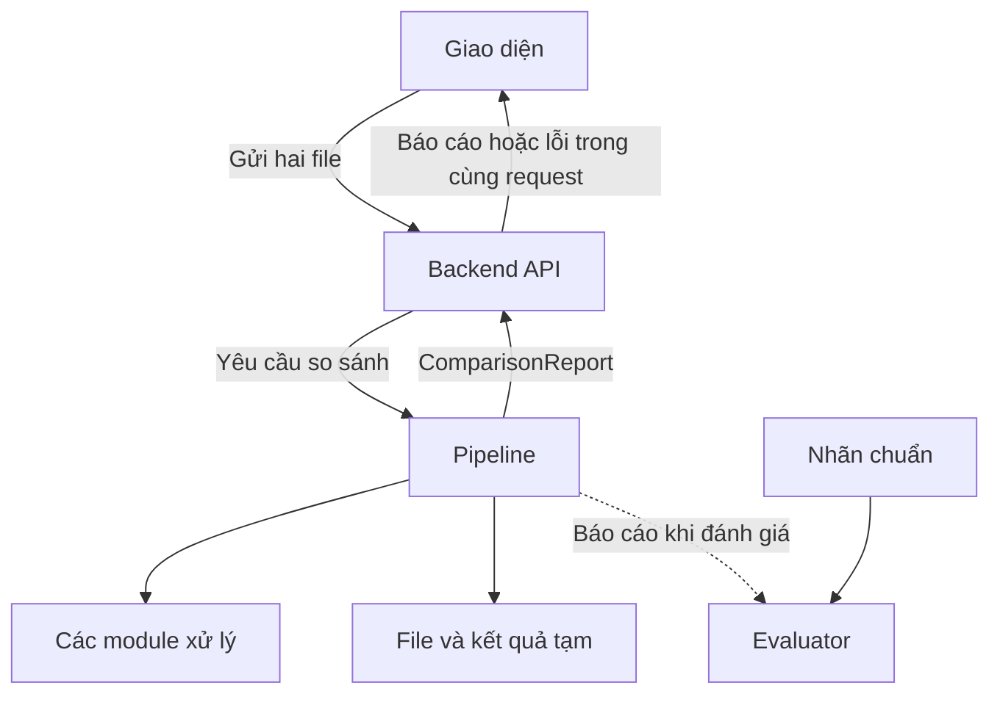
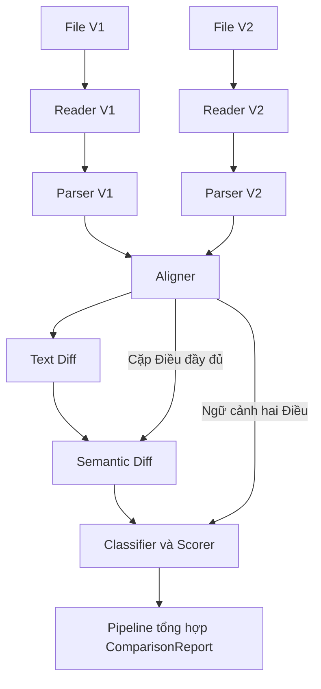

# SOFTWARE ARCHITECTURE

**Project:** Project 7 — Legal Document Change Detection
**Document Version:** 1.1.0
**Status:** Bản đề xuất đồng bộ với SRS, chờ nhóm xác nhận
**Author:** Bạch Công Dũng
**Project Leader:** Dương Đức Anh
**Related Document:** [Software Requirements Specification](srs.md)

Tài liệu này mô tả cách tổ chức các thành phần, luồng xử lý,
trách nhiệm module và các lựa chọn triển khai của hệ thống.

Phạm vi, yêu cầu chức năng, tiêu chí nghiệm thu và hợp đồng dữ liệu
chi tiết được quy định trong SRS. Architecture sử dụng cùng tên
module và cấu trúc dữ liệu với SRS.

Bản đầu sử dụng request đồng bộ. API AI bên ngoài và RAG
không thuộc kiến trúc tối thiểu; chỉ bổ sung sau khi nhóm
xác nhận nhu cầu và phương án triển khai.

---

## 1. VẤN ĐỀ VÀ MỤC TIÊU DỰ ÁN (PROBLEM & OBJECTIVES)

### 1.1. Thực trạng & Vấn đề (Problem Statement)
Khi cần đối chiếu hai phiên bản đầy đủ của cùng một văn bản quy phạm pháp luật tiếng Việt, người đọc phải rà soát các Điều để xác định nội dung được thêm, xóa hoặc sửa. Quá trình này tốn nhiều thời gian và rất dễ bỏ sót các thay đổi quan trọng (ví dụ: thay đổi thời hạn thanh toán từ 30 ngày thành 15 ngày, hoặc tăng mức phạt vi phạm, thay đổi ngữ nghĩa các cụm từ(tối thiểu,tối đa,....) ).

### 1.2. Mục tiêu hệ thống (Project Objectives)
* Tự động phát hiện các điều khoản bị thay đổi giữa hai phiên bản văn bản.
* Phân biệt chính xác giữa **thay đổi văn phong/diễn đạt** và **thay đổi ngữ nghĩa pháp lý thực sự**.
* Tự động đánh giá mức độ quan trọng và gán nhãn rủi ro cho các biến đổi pháp lý.

### 1.3. Đối tượng sử dụng (Target Users)
* Các nhóm pháp lý, quản trị rủi ro và tuân thủ (Compliance) trong doanh nghiệp.
* Chuyên viên pháp chế, luật sư và các đơn vị cung cấp dịch vụ pháp lý chuyên nghiệp.
* Khối cơ quan nhà nước, nhà làm luật, các nhóm nghiên cứu và sinh viên ngành Luật.
* cá nhân có liên quan tùy theo loại luật: giao thông, nhà đất, hôn nhân...... 

---

### 2. PHẠM VI VÀ GIỚI HẠN

### 2.1. Trong phạm vi

- So sánh hai phiên bản đầy đủ của cùng một VBQPPL Việt Nam
  bằng tiếng Việt, được người dùng xác định rõ là bản cũ V1
  và bản mới V2.
- Định dạng đầu vào: DOCX và PDF có lớp chữ.
- Bản đầu tiên tách, căn chỉnh và so sánh ở cấp Điều.
  Nội dung Khoản/Điểm được giữ bên trong từng Điều.
- Hỗ trợ ghép một Điều với một Điều; nhận diện Điều thêm mới,
  bị xóa và được đánh lại số.
- Trường hợp ghép mơ hồ hoặc nghi ngờ tách/gộp Điều phải
  được đánh dấu cần kiểm tra.
- Phát hiện thay đổi chữ, phân tích thay đổi nghĩa, phân loại
  và đánh giá mức tác động theo bộ tiêu chí nhóm thống nhất.
- Kết quả phải giữ được bằng chứng và vị trí nguồn.

### 2.2. Ngoài phạm vi của bản đầu

- OCR và PDF scan dạng ảnh.
- Dựng phiên bản mới từ văn bản chỉ liệt kê nội dung sửa đổi.
- Tự động tổng hợp nhiều văn bản sửa đổi thành một phiên bản đầy đủ.
- Tự động giải quyết căn chỉnh một-nhiều hoặc nhiều-một.
- So sánh phần nằm ngoài các Điều, như lời mở đầu, chữ ký
  và phụ lục.
- Tư vấn pháp lý tự động, hợp đồng và văn bản ngoài phạm vi
  VBQPPL tiếng Việt đã chọn.

Reader vẫn trích xuất toàn bộ nội dung có thể đọc được, bao gồm
bảng. Parser xác định phần thuộc các Điều để đưa vào so sánh.
Báo cáo phải nêu rõ phần ngoài phạm vi; kết luận “Không có thay đổi”
chỉ áp dụng cho các Điều đã xử lý.
---

## 3. SƠ ĐỒ KIẾN TRÚC TỔNG THỂ (SYSTEM ARCHITECTURE)

### 3.1. Kiến trúc logic



Pipeline điều phối các module và tổng hợp báo cáo.
Evaluator chạy riêng khi kiểm thử, không nằm trong luồng
so sánh thông thường của người dùng.

Các module thuộc cùng một backend và gọi nhau qua hàm Python.
Backend chờ Pipeline hoàn tất rồi trả kết quả trong cùng HTTP request.
Bản đầu không sử dụng Queue/Worker; chính sách vận hành nằm ở mục 7.

### 3.2. Luồng xử lý nghiệp vụ



Pipeline giữ kết quả của các bước để tổng hợp báo cáo,
bao gồm căn chỉnh, text diff, semantic diff, scoring,
cảnh báo và lỗi.

Các phần Text Diff, Semantic Diff và Scorer xử lý theo
từng AlignedPair. Reader và Parser chạy riêng cho V1 và V2.

### 3.3 Ranh giới module và cấu trúc thư mục
*Lưu ý: các đường dẫn dưới đây là đề xuất tổ chức mã nguồn, cần đối chiếu
với repo trước khi chốt. Đây không phải xác nhận các file đã tồn tại.*
```text
backend/main.py                    # Đức Anh: nhận yêu cầu, trả báo cáo
src/schemas.py                     # Đức Anh: hiện thực hợp đồng theo SRS
src/pipeline.py                    # Đức Anh: điều phối, tổng hợp báo cáo

src/reader/document_reader.py      # Thọ: đọc DOCX/PDF text
src/parser/doc_parser.py           # Thọ: tách các Điều
src/aligner/version_aligner.py     # Thọ: ghép các Điều tương ứng

src/text_diff/diff_engine.py       # Ngọc Anh: tìm thay đổi chữ
src/semantic_diff/diff_engine.py   # Ngọc Anh: xác định thay đổi nghĩa
src/classifier_scorer/scorer.py    # Ngọc Anh: phân loại, chấm tác động

src/evaluation/evaluator.py        # Tuấn Anh: đánh giá với nhãn chuẩn
frontend/                         # Tuấn Anh: giao diện demo tối thiểu

tests/fixtures/                   # Dữ liệu mẫu theo hợp đồng chung
data/raw/                         # Dũng: tài liệu nguồn
data/02_filtered_pairs/           # Dũng: cặp tài liệu đã tuyển chọn
data/manifest.csv                 # Dũng: metadata và thông tin tuyển chọn
data/gold/                        # Tuấn Anh điều phối nhãn chuẩn
docs/                             # Tài liệu chung và tài liệu module
```

Reader chịu trách nhiệm đọc file và ghi vị trí nguồn.
Parser nhận ExtractedDocument, xác định ranh giới các Điều;
không tự đọc lại file.

Pipeline tổng hợp ComparisonReport từ kết quả các module.
Các module xử lý không tự gọi giao diện hoặc phụ thuộc HTTP.
Backend quản lý vòng đời request và file tạm; Pipeline điều phối nghiệp vụ.

Adapter gọi API AI bên ngoài và các thành phần Queue/Worker chỉ được bổ sung
khi nhóm xác nhận phương án triển khai.
### 3.4. Giao tiếp giữa các module

Tên hàm dưới đây là đề xuất triển khai. Kiểu dữ liệu và quy tắc
đầu vào/đầu ra tuân theo SRS mục 1 và mục 2.

| Thành phần | Hàm đề xuất | Đầu vào | Đầu ra |
| --- | --- | --- | --- |
| Reader | read_document | File và version_id | ExtractedDocument |
| Parser | parse_document | ExtractedDocument | list[Clause] |
| Aligner | align_versions | Hai list[Clause] | list[AlignedPair] |
| Text Diff | compute_text_diff | AlignedPair | TextDiffResult |
| Semantic Diff | detect_semantic_changes | AlignedPair và TextDiffResult | SemanticDiffResult |
| Classifier & Scorer | classify_and_score | AlignedPair và SemanticDiffResult | list[ScoringResult] |
| Pipeline | run_comparison | Hai file và thông tin lần so sánh | ComparisonReport |
| Evaluator | evaluate | Báo cáo dự đoán và nhãn chuẩn | Các chỉ số và kết quả đối chiếu |

Mỗi module phải có thể kiểm thử riêng bằng dữ liệu mẫu đúng
hợp đồng. Khi module phía trước chưa hoàn thành, dùng fixture
hoặc mock tương ứng để tiếp tục phát triển.

Không duy trì một bộ hợp đồng khác với SRS. Nếu cần thay đổi,
nhóm phải cập nhật hợp đồng, schema và dữ liệu mẫu cùng nhau.


### 3.5. Quy ước dữ liệu dùng chung

Định nghĩa chi tiết nằm trong SRS mục 1. Architecture chỉ tóm tắt
các quy ước cần thiết để hiểu luồng xử lý.

- Clause đại diện một Điều, gồm:
  unit_id, id, title, content và source_refs.
- AlignedPair gồm pair_key, align_type, v1, v2,
  needs_review và review_reason.
- align_type nhận PAIRED, ADDED hoặc DELETED.
- Ghép mơ hồ được biểu diễn bằng needs_review = true;
  loại ghép khi đó chỉ là kết quả tạm thời.
- Một AlignedPair có thể sinh nhiều SemanticChange.
- is_meaningful_change nhận true, false hoặc null.
  null biểu thị chưa đủ căn cứ và phải có cảnh báo kiểm tra.
- Mỗi SemanticChange có một ScoringResult tương ứng.
- category là một giá trị hoặc null theo hợp đồng SRS hiện tại;
  danh mục giá trị cần nhóm thống nhất.
- significance nhận LOW, MEDIUM, HIGH, CRITICAL hoặc null.
- Chỉ đổi diễn đạt: significance = LOW.
- Chưa xác định có đổi nghĩa:
  significance = null và is_critical = null.
- comparison_id định danh lần so sánh;
  pair_key định danh cặp Điều;
  change_id định danh từng thay đổi.
- ComparisonReport.status nhận SUCCESS, PARTIAL hoặc FAILED.
- None/null biểu thị phần chưa xử lý hoặc chưa xác định theo
  từng trường; danh sách rỗng chỉ dùng khi bước tương ứng đã
  hoàn thành nhưng không có kết quả cần ghi nhận.
- Cảnh báo phải được giữ xuyên suốt đến báo cáo và giao diện.

comparison_id chỉ định danh lần so sánh, không phải mã job để truy vấn sau.
ComparisonReport.status mô tả mức hoàn tất của báo cáo, không phải mã HTTP.
Bản đầu không cung cấp trạng thái job hoặc API polling.

### 3.6. Ví dụ AlignedPair

Ví dụ tự tạo để minh họa hợp đồng, không phải văn bản pháp luật thật.
Các source_refs phải tồn tại trong ExtractedDocument của phiên bản
tương ứng khi dùng làm fixture chạy được.

```json
{
  "pair_key": "v1:article_5|v2:article_6",
  "align_type": "PAIRED",
  "v1": {
    "unit_id": "v1:article_5",
    "id": "Điều 5",
    "title": "Thời hạn thực hiện",
    "content": "1. Hồ sơ phải được nộp trong thời hạn 30 ngày.",
    "source_refs": ["docx:paragraph_12", "docx:paragraph_13"]
  },
  "v2": {
    "unit_id": "v2:article_6",
    "id": "Điều 6",
    "title": "Thời hạn thực hiện",
    "content": "1. Hồ sơ phải được nộp trong thời hạn 15 ngày.",
    "source_refs": ["docx:paragraph_15", "docx:paragraph_16"]
  },
  "needs_review": false,
  "review_reason": ""
}
```

Trong ví dụ, thay đổi số Điều được thể hiện ở AlignedPair.
Text Diff so sánh title/content và xác định thay đổi
“30 ngày” thành “15 ngày”.


## 4. WORKFLOW VÀ PHÂN CÔNG

### 4.1. Workflow

1. Người dùng chọn hai file và xác định bản cũ V1, bản mới V2.
2. Backend kiểm tra đầu vào, cấp comparison_id, lưu file tạm riêng cho lần so sánh và gọi Pipeline trong cùng request.
3. Reader đọc từng file, tạo ExtractedDocument.
4. Parser tách từng phiên bản thành list[Clause] ở cấp Điều.
5. Aligner nhận hai danh sách và tạo list[AlignedPair].
6. Với từng AlignedPair:
   - Text Diff tìm đoạn chữ thêm, xóa hoặc thay thế.
   - Semantic Diff phân tích thay đổi nghĩa với ngữ cảnh hai Điều.
   - Classifier & Scorer phân loại và chấm từng SemanticChange.
7. Pipeline tổng hợp ComparisonReport, giữ các cảnh báo và lỗi.
8. Backend trả báo cáo hoặc lỗi trong cùng request để giao diện hiển thị; giải phóng tài nguyên và dọn file tạm khi không còn tác vụ sử dụng.

Giao diện chờ phản hồi, hiển thị đang xử lý và ngăn gửi lặp khi request còn chạy.
Không hiển thị phần trăm tiến độ giả; không tự gửi lại yêu cầu so sánh khi timeout.
Mất kết nối không đồng nghĩa Pipeline đã dừng; chính sách thời gian chạy xem mục 7.

Data collection chạy độc lập với luồng so sánh, phục vụ tạo dữ liệu
phát triển, demo và đánh giá. Evaluator chạy riêng trên báo cáo
và nhãn chuẩn.

### 4.2. Phân công dự kiến

| Thành viên | Trách nhiệm chính |
| --- | --- |
| Bạch Công Dũng | Kiến trúc, tài liệu tổng quát, metadata và tuyển chọn dữ liệu; phối hợp đặc tả hợp đồng |
| Dương Đức Anh | Nhóm trưởng, Backend, Pipeline, hiện thực schema, tổng hợp báo cáo và tích hợp |
| Bùi Quang Thọ | Reader, Parser và Aligner |
| Đoàn Ngọc Anh | Text Diff, Semantic Diff, Classifier & Scorer |
| Đỗ Tuấn Anh | Evaluator, kiểm thử độc lập và giao diện demo |

### 4.3. Quy tắc phối hợp

- SRS là nguồn tham chiếu chính cho hợp đồng dữ liệu hiện tại.
- Dũng và Đức Anh phối hợp cập nhật tài liệu; các chủ module
  review phần đầu vào/đầu ra liên quan trước khi chốt.
- Thay đổi hợp đồng phải được nhóm trưởng phê duyệt, cập nhật
  schema và fixture, đồng thời thông báo các module liên quan.
- Mỗi module có dữ liệu mẫu, cách chạy riêng và kiểm thử riêng.
- Bộ fixture gồm không đổi, đổi diễn đạt, đổi nghĩa, thêm/xóa,
  đánh lại số Điều và ghép mơ hồ.
- Dữ liệu test có nhãn được giữ riêng với dữ liệu dùng chỉnh thuật toán.
- Bàn giao gồm mã nguồn, input/output mẫu, cách kiểm tra,
  giới hạn đã biết và PR.

---

## 5. YÊU CẦU CHẤT LƯỢNG ẢNH HƯỞNG ĐẾN KIẾN TRÚC

Các mục tiêu trong SRS:

- Change F1 ≥ 0,90.
- Critical Change Recall ≥ 0,95 trên bộ kiểm thử độc lập.

Đây là các ngưỡng SRS đang nêu cho nghiệm thu, chưa phải chất lượng
đã được chứng minh. Nhóm cần xác nhận trước khi dùng làm tiêu chí
nghiệm thu chính thức.

Evaluator tuân theo các nguyên tắc:

- Đối chiếu ở cấp từng thay đổi; dự đoán và nhãn chuẩn được
  ghép một-một, không tính trùng.
- Thay đổi chuẩn bị bỏ sót vẫn phải được tính, kể cả khi nguyên nhân
  đến từ Reader, Parser hoặc Aligner.
- Một thay đổi CRITICAL chỉ được tính tìm đúng khi đối chiếu
  đúng thay đổi và dự đoán is_critical = true.
- Kết quả cần kiểm tra chưa được giải quyết không tính là tìm đúng.
- Mẫu số bằng 0 trả null kèm lý do.
- Báo số mẫu và số kết quả cần kiểm tra cùng các chỉ số.

Để hỗ trợ đánh giá, các module phải giữ định danh, bằng chứng,
vị trí nguồn và cảnh báo đến ComparisonReport.

Định nghĩa yêu cầu xem SRS. Quy trình tạo nhãn, chia dữ liệu và
cách tính chi tiết được hoàn thiện trong Evaluation Plan.

---

### 6. GIẢ ĐỊNH VÀ RỦI RO

### 6.1. Giả định

- Người dùng cung cấp hai bản đầy đủ tương ứng và xác định rõ cũ/mới.
- File thuộc định dạng hỗ trợ và có nội dung chữ trích xuất được.
- Không giả định tiêu đề Điều được đánh dấu bằng Word Heading.
- Việc sử dụng mô hình hoặc API ngoài cần được nhóm xác nhận.
  Yêu cầu kết nối mạng chỉ áp dụng khi lựa chọn đó được sử dụng.

### 6.2. Rủi ro và phương án xử lý

| Rủi ro | Phương án |
| --- | --- |
| Đọc thiếu hoặc sai thứ tự nội dung | Reader giữ thứ tự và vị trí nguồn; kiểm thử trên file có bảng và nhiều trang |
| Parser nhận nhầm câu dẫn chiếu là đầu Điều | Kiểm tra ranh giới, cấu trúc và các ca dẫn chiếu trong fixture |
| Phụ lục bị gộp vào Điều cuối | Parser nhận diện điểm kết thúc phần Điều và phần ngoài phạm vi |
| Đánh lại số, ghép mơ hồ hoặc tách/gộp | Aligner kết hợp số Điều, tiêu đề và nội dung; cảnh báo phần chưa chắc chắn |
| File lớn hoặc tác vụ kéo dài | Giới hạn dung lượng, thời gian, bộ nhớ và mức đồng thời; xử lý theo đơn vị phù hợp |
| Thiếu nhãn chuẩn | Gán nhãn có hướng dẫn, đối soát bất đồng và duy trì tập test độc lập |
| Semantic Diff chưa đủ căn cứ | Trả kết luận chưa xác định và needs_review; không tự coi là không đổi nghĩa |
| Module phân tích hoặc chấm điểm thất bại | Giữ lỗi và phần chưa xử lý trong ComparisonReport; dùng PARTIAL hoặc FAILED phù hợp |
| API ngoài gặp lỗi nếu được sử dụng | Timeout, retry có giới hạn và báo phần chưa hoàn tất |
| Hai module dùng hợp đồng khác nhau | Kiểm tra schema, fixture chung và review thay đổi trước khi tích hợp |

Few-shot, embedding hoặc RAG là các lựa chọn cải thiện thuật toán,
không thay thế dữ liệu nhãn chuẩn để đánh giá.

---
## 7. PHƯƠNG ÁN TRIỂN KHAI VÀ CÁC QUYẾT ĐỊNH CẦN CHỐT

### 7.1. Quyết định triển khai bản đầu

- Dùng request đồng bộ: API nhận hai file, gọi Pipeline, chờ kết quả và trả phản hồi trong cùng request.
- Tổ chức một backend chia module; mỗi module có thể kiểm thử độc lập qua hàm và schema chung.
- Không triển khai Redis, Celery, Queue/Worker, API tạo job hoặc polling cho bản đầu.
- Pipeline giữ giao diện run_comparison; không phụ thuộc HTTP, giao diện hoặc hạ tầng hàng đợi.
- Xử lý các cặp Điều tuần tự ở bản đầu để dễ kiểm thử và kiểm soát chi phí; chỉ tăng mức đồng thời sau khi đo và đặt giới hạn.
- Request đồng bộ là cách trả kết quả cho client; không bắt buộc mọi thao tác I/O trong mã nguồn phải blocking. Nếu dùng framework async, không chạy tác vụ blocking/CPU nặng trực tiếp trên event loop.

Lý do: phạm vi demo nhỏ, không OCR, không lưu lịch sử lâu dài; ưu tiên
hoàn thiện và đánh giá luồng so sánh. Đây là quyết định về độ đơn giản
triển khai, không phải khẳng định Pipeline luôn chạy nhanh.

### 7.2. API và giao diện

API upload dự kiến: POST /api/compare, nhận multipart/form-data
với hai file doc_v1 và doc_v2; trả ComparisonReport trong cùng
request. Cấu trúc phản hồi, mã HTTP và lỗi được quy định trong
docs/api-contract.md.

Đây là giao diện mục tiêu; API baseline hiện tại vẫn nhận
hai chuỗi text và chưa hỗ trợ upload file.

- comparison_id dùng liên kết log và báo cáo; không có cam kết truy vấn lại kết quả bằng mã này.
- Backend phân biệt lỗi kiểm tra đầu vào, lỗi toàn bộ lần so sánh và lỗi riêng từng cặp Điều.
- Nếu một số cặp lỗi nhưng vẫn tổng hợp được báo cáo, giữ bằng chứng, cảnh báo và phần chưa xử lý; dùng PARTIAL theo SRS.
- Không biến lỗi Semantic Diff thành kết luận không có thay đổi hoặc danh sách rỗng giả.
- API contract quy định rõ ánh xạ HTTP status, error body và ComparisonReport.status; không dùng ba trường hợp SUCCESS/PARTIAL/FAILED làm mã HTTP.
- Giao diện có trạng thái chờ, báo cáo và lỗi; ngăn gửi lặp khi đang chờ. Không tự retry toàn bộ POST.
- Không cung cấp chức năng hủy tác vụ hoặc tiếp tục xem job sau khi tải lại trang trong bản đầu.

### 7.3. Giới hạn, timeout và xử lý lỗi

Trước khi tích hợp API thật, nhóm phải chốt giới hạn dung lượng mỗi file,
số Điều/nội dung được xử lý, số request so sánh đồng thời và ngân sách
thời gian xử lý. Ghi giá trị, đơn vị và môi trường đo trong SRS và
docs/development-guide.md; architecture không tự đặt ngưỡng chưa đo.

- Kiểm tra dung lượng/định dạng sớm; sau Reader/Parser kiểm tra giới hạn nội dung và khả năng trích xuất.
- Khi đủ số tác vụ cho phép, từ chối yêu cầu mới bằng lỗi được đặc tả; không tạo hàng đợi nền ngầm không giới hạn.
- Đặt timeout cho từng lần gọi API ngoài và deadline cho toàn bộ Pipeline. Retry lỗi tạm thời có giới hạn, nằm trong deadline còn lại.
- Kiểm tra deadline giữa các bước/cặp Điều; timeout của HTTP hoặc việc đóng trang không tự dừng mã đang chạy.
- Tác vụ thư viện không hỗ trợ ngắt cần được giới hạn đầu vào hoặc cô lập nếu phải bảo đảm dừng cứng; không tuyên bố có hard timeout khi chỉ dừng chờ phản hồi.
- Cấu hình thời gian chờ của client/server/proxy theo ngân sách xử lý, có thời gian dự phòng để trả lỗi và dọn tài nguyên.
- Khi hết ngân sách, chỉ trả PARTIAL nếu đã tạo được báo cáo hợp lệ theo SRS; nếu không, trả lỗi/FAILED theo API contract. Không để request chờ vô hạn.
- Đo thời gian Reader, Parser, Aligner, Text Diff, Semantic Diff, Scorer và tổng Pipeline; ghi số Điều/cặp cần phân tích và số lần gọi mô hình.

### 7.4. Quản lý file và kết quả

- Mỗi lần so sánh dùng thư mục tạm riêng gắn comparison_id; không dùng nguyên tên file do client cung cấp làm đường dẫn lưu.
- File tạm chỉ xóa sau khi các tác vụ sử dụng file đã kết thúc, kể cả khi request mất kết nối hoặc có retry API ngoài.
- Dọn tài nguyên trong cơ chế finally hoặc tương đương; bổ sung dọn file sót do tiến trình dừng bất thường, bảo đảm không xóa file đang được dùng.
- Báo cáo trả trực tiếp trong response; bản đầu không yêu cầu database hay lưu lịch sử lâu dài.
- Nếu kết quả được ghi ra file tạm để tạo response, giữ file đến khi gửi xong rồi dọn.
- Không ghi toàn bộ nội dung tài liệu vào log; log định danh, thời gian, bước xử lý và lỗi cần thiết.

### 7.5. Các quyết định còn cần chốt

- Công nghệ backend/frontend và phiên bản môi trường chạy.
- Phương pháp Semantic Diff, embedding/LLM nếu có; vai trò cụ thể và cách gọi mô hình.
- API AI có bắt buộc không; đặc tả và quyền truy cập. RAG chỉ bổ sung khi có nhu cầu đã xác định.
- Giới hạn đầu vào, số request đồng thời, timeout/retry và môi trường đo hiệu năng.
- Danh mục category, quy tắc severity và cách tạo nhãn chuẩn.
- Tên trường API, mã HTTP, error body, dữ liệu mẫu và cách xử lý PARTIAL/FAILED.

Định dạng đầu vào hiện giữ PDF có lớp chữ và DOCX như mục 2.1 của bản
được cung cấp. Nếu nhóm chốt chỉ PDF, cần sửa đồng thời SRS, BRD,
README, Reader, ví dụ source_refs và dữ liệu mẫu; không tự xem DOCX
là đã bị loại khỏi phạm vi.

### 7.6. Điều kiện xem xét lại quyết định

Đo trên các cặp tài liệu đại diện: ngắn/dài, ít/nhiều thay đổi, có bảng,
đánh lại số Điều và ghép mơ hồ. Nếu thời gian thường vượt ngân sách
chờ, không ổn định do mô hình/API ngoài, hoặc phát sinh yêu cầu theo dõi
tiến độ và lấy kết quả sau khi tải lại trang, nhóm xem xét job bất đồng bộ.

Khi thay đổi, giữ hợp đồng nghiệp vụ của Pipeline; bổ sung hợp đồng job,
Queue/Worker, nơi lưu trạng thái/kết quả và vòng đời file. Cập nhật SRS,
architecture và API contract cùng nhau. Đây là hướng mở rộng, không
thuộc các thành phần phải xây dựng cho bản đầu.